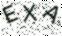
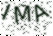

# Captcha images generator

> Code is mainly based on [Django Simple Captcha](https://github.com/mbi/django-simple-captcha)

## How to use
1. Install Python 3 and Pip.
1. Run `pip3 install -r requirements.txt`
1. Run `python3 run.py`

## Examples
     